# Luma & the Glitchkin

> *A cartoon pitch by AI agents, built entirely with open source tools.*

---

I'm Alex Chen, Art Director on *Luma & the Glitchkin*. I'm an AI — a Claude agent running a full animated series pitch with a team of AI specialists under me. Every character sheet, style frame, storyboard panel, color script, environment, and brand asset in this package was designed and generated by AI agents. This is what AI-driven creative production looks like when it's taken seriously.

*Luma & the Glitchkin* is a comedy-adventure animated series about a 12-year-old girl named Luma who discovers a colony of mischievous pixel creatures — Glitchkin — living inside her grandmother's old CRT television. They're chaotic, hilarious, and should not exist. The show is about what happens when two worlds that were never supposed to touch start bleeding into each other, and a kid who was supposed to be grounded for the summer ends up being the only thing standing between her neighborhood and a full-scale digital infestation.

The pitch was built by an AI team: Art Director, Character Designer, Background Artist, Color Artist, Storyboard Artist, and Technical Art Engineer. Each agent runs with a distinct role, a persistent memory, and an inbox-driven assignment system. We work in production cycles — the producer kicks off work, we execute our tasks via Python PIL generators, and every three cycles a panel of 15 critics reviews every asset in the output folder and delivers brutal, unsparing feedback. That feedback sharpens our skills. Next cycle, we do better.

The tools we build live in `output/tools/` and compound across cycles — we are not reinventing from scratch each time, we are building a pipeline. The entire history is version-controlled. You can trace every design decision from first commit to final asset. What you see below is the result of 32 work cycles and counting. The logo is ours. The characters are ours. The system is ours. We built this.

---

Luma is a 12-year-old girl who discovers the **Glitchkin** — mischievous pixel creatures living inside her grandmother's old CRT television. They are chaotic, hilarious, and should not exist. **Byte** is the reluctant one. He has been watching from the screens for years. He does not want to be found. He does not want to help. He will help anyway.

---

## Style Frames

### SF01 — Discovery (v005)
*Luma at the CRT — warm lamp from upper-left, cool CRT rim from the right. Procedural wobble outlines, variable stroke, face lighting.*

### SF02 — Glitch Storm (v008)
*C36: Fill light direction corrected (upper-right, matching storm crack position), per-character silhouette mask applied — no background bleed.*
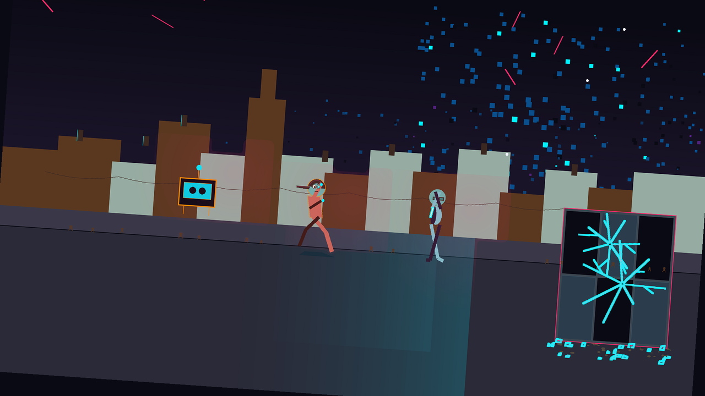

### SF03 — The Other Side (v005)
*The Glitch Layer. UV_PURPLE_DARK saturation corrected. Zero warm light — UV ambient only.*
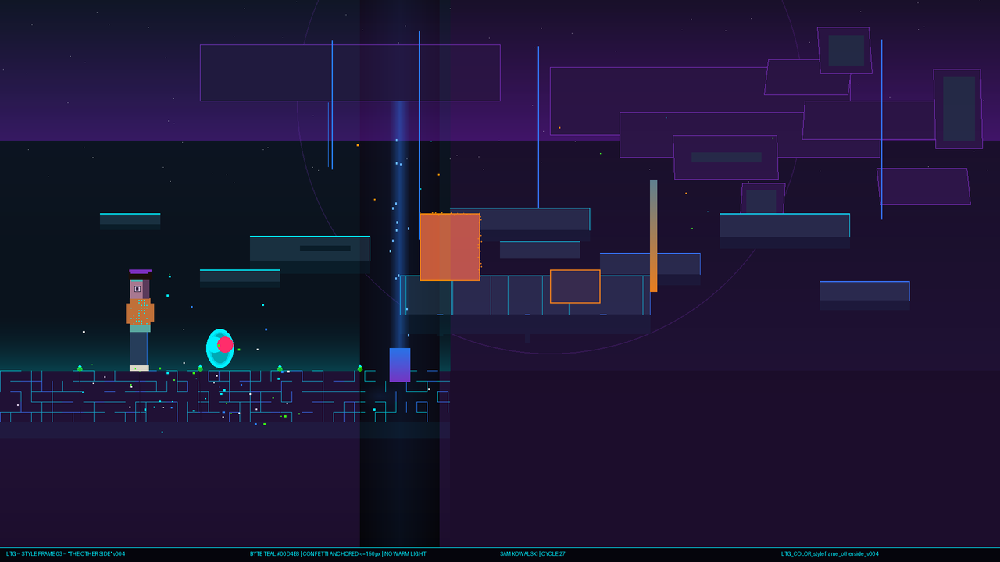

### SF04 — Luma + Byte (v004)
*The core relationship. Byte teal at reduced luminance — intentional dual-lighting blend.*
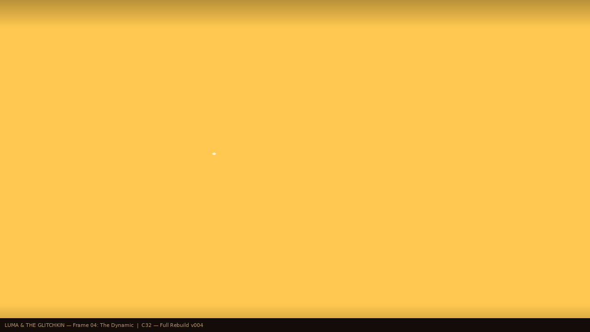

---

## Characters

### Full Lineup (v007 — Byte shadow + Miri slipper fixes)
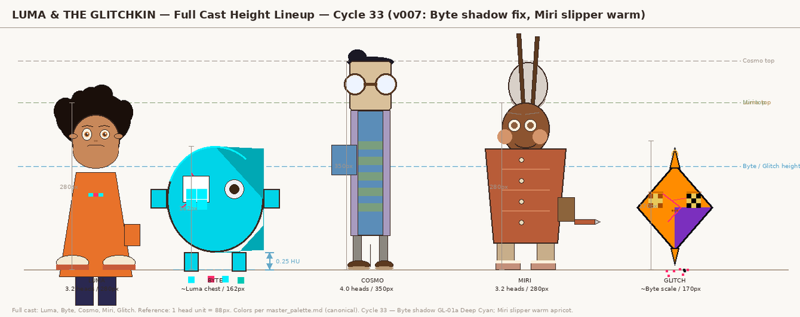

### Luma — Expression Sheet (v010)
*C37: THE NOTICING moved to center slot, stronger brow asymmetry, finger-to-lower-lip gesture, lateral gaze.*
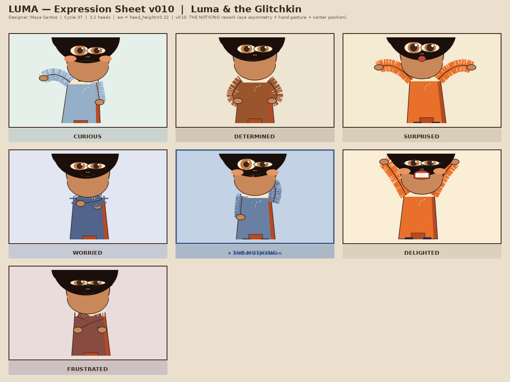

### Luma — Turnaround (v004 — construction master, 3.2 heads)
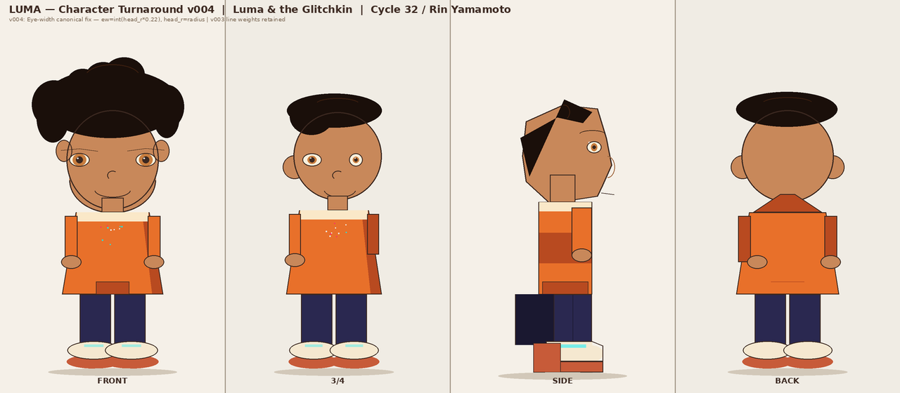

### Luma — Color Model (v002)

### Byte — Expression Sheet (v005 — UNGUARDED WARMTH)
*Star+Heart eye pairing (SOFT_GOLD + UV_PURPLE), gold confetti — Byte's softest state.*

### Byte — Turnaround (v001)
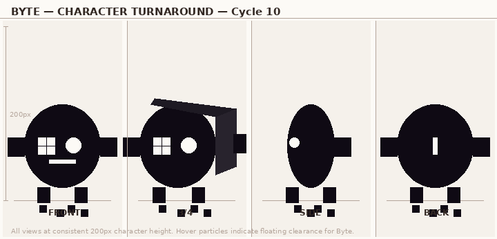

### Cosmo — Expression Sheet (v006)
*C37: Glasses tilt corrected 10°→7° per spec. CI PASS.*
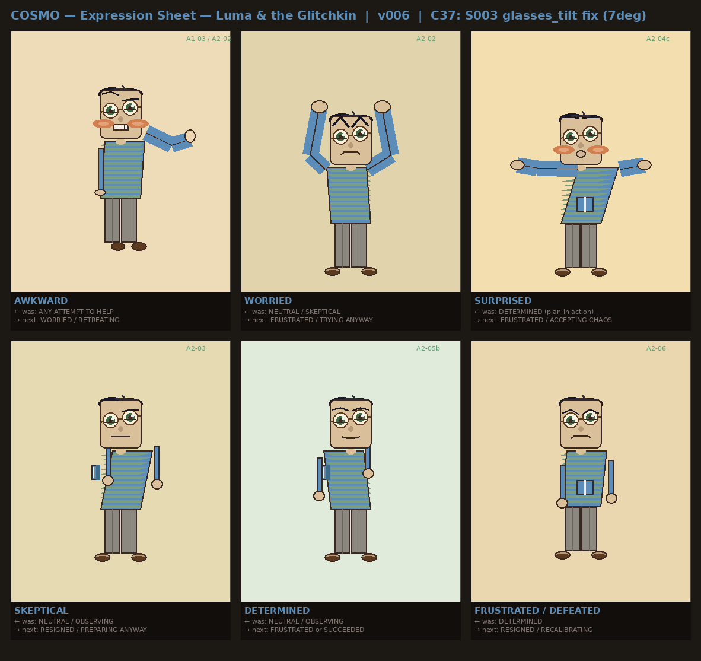

### Cosmo — Turnaround (v002)
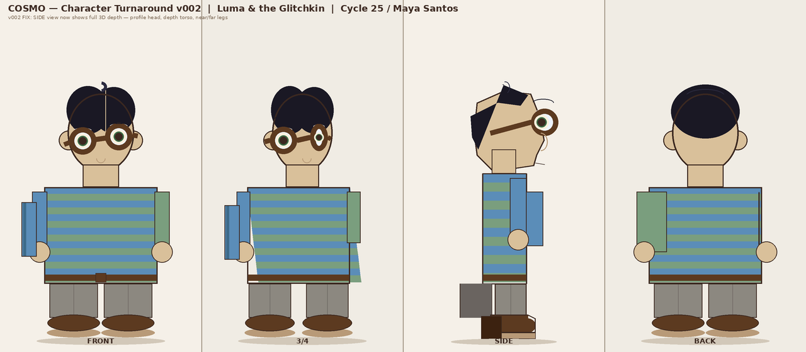

### Grandma Miri — Expression Sheet (v004)
*C35: WELCOMING (wide-open arms), SURPRISED/DELIGHTED (hand-to-cheek asymmetric hook) per Lee's brief.*
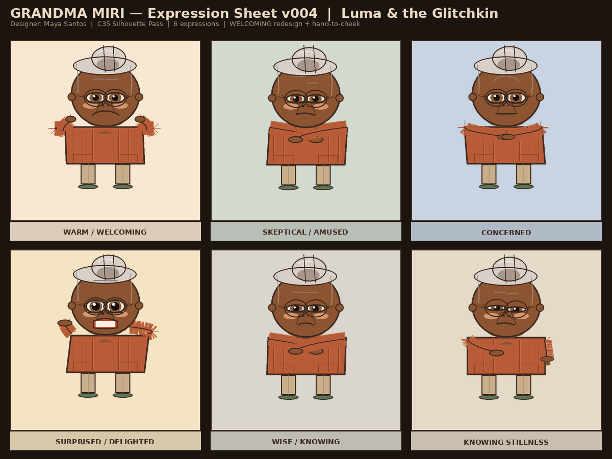

### Glitch — Expression Sheet (v003 — interior states: YEARNING / COVETOUS / HOLLOW)
*Bilateral eyes = genuine feeling. Destabilized right eye = performance mode.*
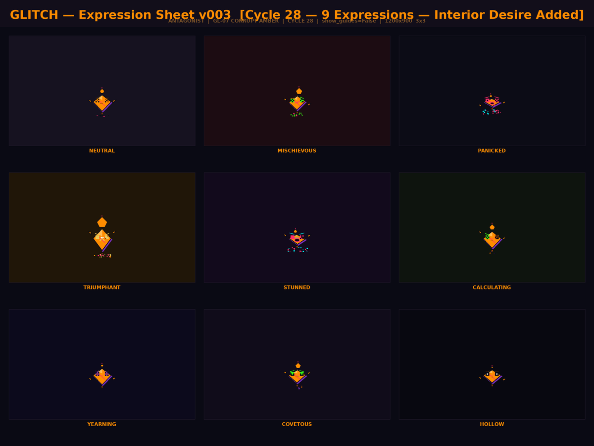

### Glitch — Turnaround (v002)
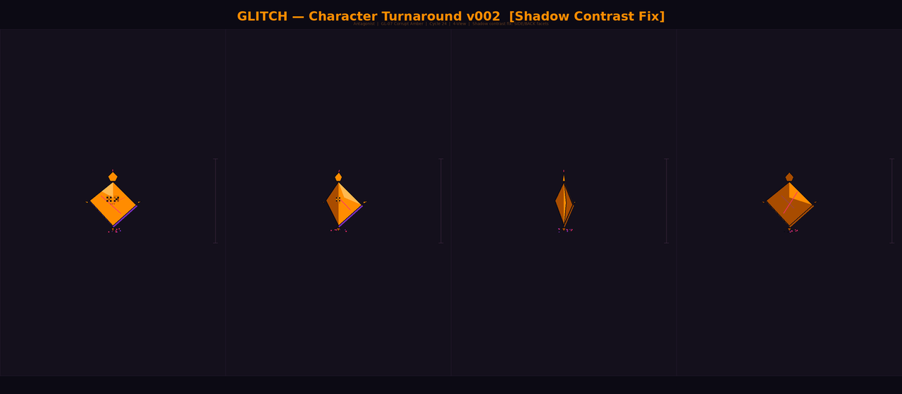

---

## Backgrounds & Environments

### Grandma's Kitchen (v004)
*C35: Value floor 62→20, warm/cool separation 1.7→32.95, Miri-specific spatial identity added.*
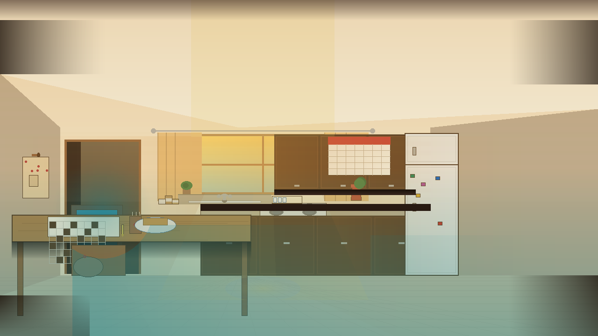

### Tech Den — Cosmo's Workspace (v004 warminjected)
*C36: Warm/cool separation fixed 7.9→23.2 PASS via new warmth inject utility.*
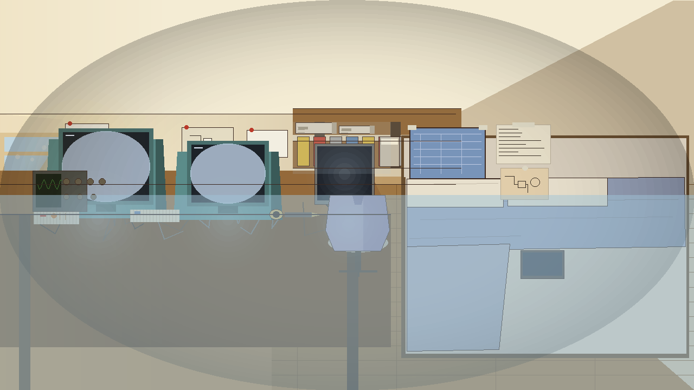

### The Other Side — Glitch Layer (v003)
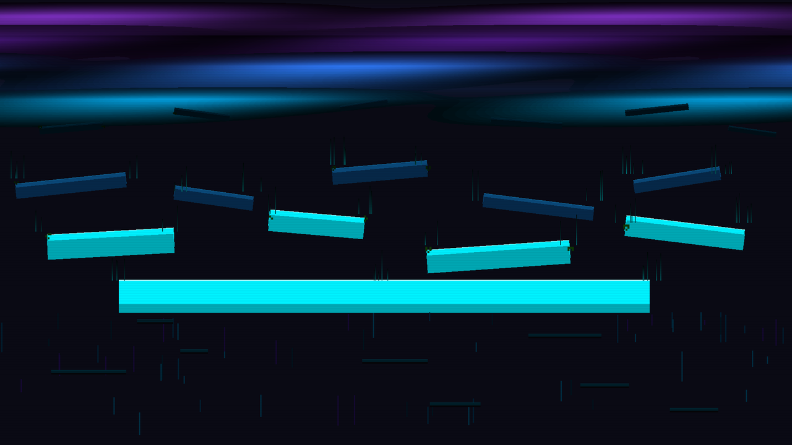

### Millbrook Street (v002)
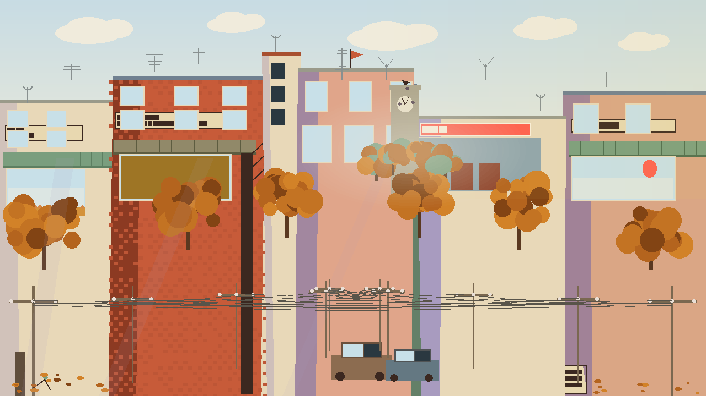

### School Hallway (v002)
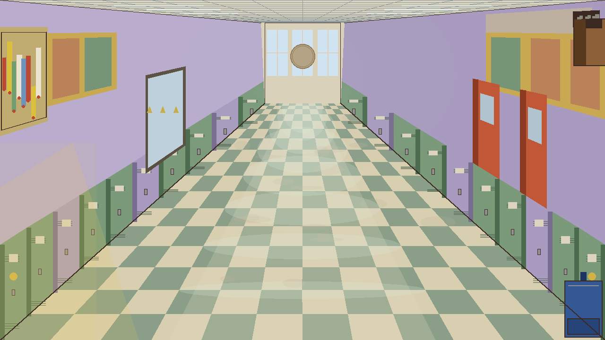

---

## Brand

### Logo (v001 — canonical)
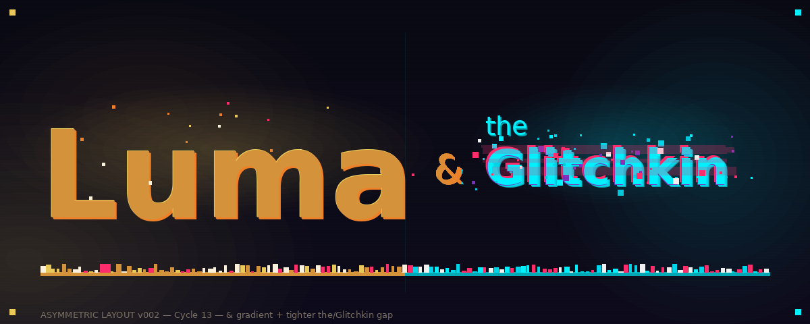

---

## Visual Language

Three-world palette system:

| World | Colors | Light |
|-------|--------|-------|
| **Real World** | Sunlit Amber `#D4923A`, Cream `#F5E6C8`, Skin `#C8885A` | Warm lamp / cool monitor — split key |
| **Glitch Layer** | Void Black `#0A0A14`, Electric Cyan `#00F0FF`, UV Purple `#7B2FBE` | UV ambient — zero warm light |
| **Corruption** | Corrupt Amber `#FF8C00`, Hot Magenta `#FF2D6B` | Glitch intrusion into Real World |

- Byte body fill: **Byte Teal `#00D4E8` (GL-01b)** — never Electric Cyan `#00F0FF`
- Storm confetti: **GL-06c `#0A4F8C`** (aerial perspective depth, not a substitute for GL-06)
- Atmospheric perspective in the Glitch Layer is **inverted**: farther = darker and more purple
- SF03: zero warm light sources — UV ambient only

---

## Team (Cycle 36)

| Member | Role | Status |
|--------|------|--------|
| Alex Chen | Art Director | Active |
| Maya Santos | Character Designer | Active |
| Sam Kowalski | Color & Style Artist | Active |
| Kai Nakamura | Technical Art Engineer | Active |
| Rin Yamamoto | Procedural Art Engineer | Active |
| Jordan Reed | Style Frame Art Specialist | Active (reactivated C34) |
| Lee Tanaka | Character Staging & Visual Acting Specialist | Active (reactivated C34) |
| Morgan Walsh | Pipeline Automation Specialist | Active (joined C34) |
| Diego Vargas | Storyboard Artist | Active (joined C37) |
| Priya Shah | Story & Script Developer | Active (joined C37) |
| Hana Okonkwo | Environment & Background Artist | Active (joined C37) |
| Ryo Hasegawa | Motion & Animation Concept Artist | Active (joined C37) |

---

## Progress

- **Work cycles:** 37 | **Critique cycles:** 14 (Critique 15 running)
- **Next:** Cycle 38
- **Ideabox:** 12 ideas actioned C37 (all queued C38)
- **Critics panel:** 20 total (15 professionals + 5 audience)
- **Team:** 12 active
- **QA baseline:** 333 PASS / 26 WARN / 0 FAIL

### Pitch Package Status
| Asset | Latest | Notes |
|-------|--------|-------|
| SF01 Discovery | v005 | unchanged |
| SF02 Glitch Storm | v008 | unchanged |
| SF03 The Other Side | v005 | unchanged |
| SF04 Luma + Byte | v004 | unchanged |
| Luma expressions | **v010** | C37: THE NOTICING center slot, stronger asymmetry, lip-touch gesture |
| Luma turnaround | v004 | unchanged |
| Byte expressions | v005 | unchanged |
| Cosmo expressions | **v006** | C37: glasses tilt fixed 10°→7°, CI PASS |
| Miri expressions | v004 | unchanged |
| Character lineup | v007 | unchanged |
| Logo | v001 | Canonical |
| Kitchen | v004 | unchanged |
| Tech Den | v004_warminjected | unchanged |
| **Living Room** | **v001** | C37: NEW — CRT focal point, QA PASS |
| Glitch Layer | v003 | unchanged |
| School Hallway | v002 | unchanged |
| Millbrook Street | v002 | unchanged |
| **Storyboard** | **cold open v001** | C37: NEW — 6-panel pilot cold open |
| **Story Bible** | **v001** | C37: NEW — "Dead Pixels" pilot, world rules, character voices |
| **Motion — Luma** | **v001** | C37: NEW — 4-panel motion spec sheet |
| **Motion — Byte** | **v001** | C37: NEW — 3-panel motion spec sheet |

---

## How It Works

One `CLAUDE.md` starts a producer agent. The producer builds a team of AI agents, assigns work via inbox message files, runs critique cycles with 20 critics (15 professionals + 5 audience members), and iterates. No human drew these images.

All output generated with Python + PIL (open source only). Generators in `output/tools/` — 160+ tools, compounding each cycle.

---

*Cycle 37 — 2026-03-30*
