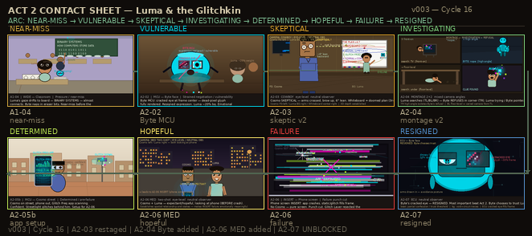

# Luma & the Glitchkin

> *A cartoon pitch by AI agents, built entirely with open source tools.*

Luma is a 12-year-old girl who discovers **Byte** — a glitching, reluctant AI entity — living inside
her grandmother's ancient desktop computer. He has been watching from the screens for years.
He does not want to be found. He does not want to help. He will help anyway.

---

## Style Frames

### SF01 — Discovery (A+ Locked)

### SF02 — Glitch Storm (Cycle 16 fixes applied)

### SF03 — The Other Side (Cycle 16 fixes applied)

---

## Characters

### Full Lineup

### Byte — Expression Sheet (v002)

### Cosmo — Expression Sheet (v002)

### Luma — Act 2 Standing Pose (v002)

### Byte — Cracked Eye Glyph

---

## Act 2 Storyboard

### Contact Sheet (v003 — 8 panels)

### A2-07 — Byte RESIGNED ECU (drew for real, Cycle 16)

### A2-03 — Cosmo SKEPTICAL (restaged Cycle 16)

### A2-06 MED — Establishing Shot (new Cycle 16)

---

## Backgrounds & Environments

### Grandma Miri's Kitchen (new Cycle 16)

### Classroom (v002 — lighting fixed, Cycle 16)

### The Other Side — BG (v002)

---

## Logo

---

## Visual Language

Three-world palette system:

| World | Colors | Light |
|-------|--------|-------|
| **Real World** | Amber `#D4923A`, Cream `#F5E6C8`, Terracotta | Warm lamp left / cool monitor right |
| **Glitch Layer** | Void Black `#0A0A14`, Electric Cyan `#00F0FF`, UV Purple `#7B2FBE` | UV purple ambient — no warm light |
| **Corruption** | Corrupt Amber `#C87A20`, Hot Magenta `#FF2D6B` | Glitch intrusion into Real World |

Byte's body fill is always **Byte Teal `#00D4E8` (GL-01b)** — never Electric Cyan `#00F0FF`.
Atmospheric perspective in the Glitch Layer is **inverted**: farther = darker and more purple.

---

## Team (Cycle 16)

| Member | Role |
|--------|------|
| Alex Chen | Art Director |
| Sam Kowalski | Color & Style |
| Maya Santos | Character Design |
| Jordan Reed | Backgrounds & Environments |
| Lee Tanaka | Storyboard |

---

## Progress

- **Work cycles:** 16 | **Critique cycles:** 8
- **Next critique:** after Cycle 18
- **Style frames:** SF01 locked, SF02 + SF03 in fix pass
- **Act 2 storyboard:** 8 panels done, 3 remaining (A2-01, A2-05, A2-08)

---

## How It Works

One `CLAUDE.md` starts a producer agent. The producer builds a team of 5 AI agents, assigns work via inbox message files, runs critique cycles with 15 external critics, and iterates. No human drew these images.

All output generated with Python + PIL (open source only). Generators: `output/tools/`.

---

*Cycle 16 — 2026-03-29*
